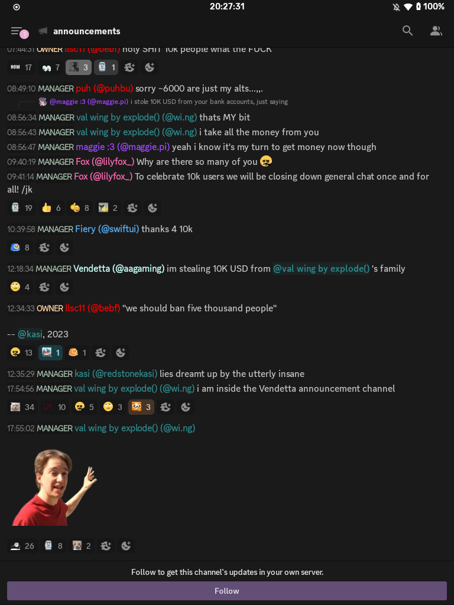

# Revenge/Bunny Plugins by [Martin](https://github.com/Martinz64)

### [Platform Indicators](https://martinz64.github.io/vendetta-plugins/PlatformIndicators)
- Shows the devices someone is currently using discord on
> 
### [File Size On Picker](https://martinz64.github.io/vendetta-plugins/FileSizeOnPicker)
- Adds file sizes in the media picker
> 

## Deprecated/discontinued plugins-
### [No Compression](https://martinz64.github.io/vendetta-plugins/NoCompression) (Deprecated!)
- Prevents Discord from compressing files when uploading
>  
### [Screenshare Settings](https://martinz64.github.io/vendetta-plugins/ScreenshareSettings) (Deprecated!)
- Adds additional settings when screensharing in VC
>  
### [Square profile pictures](https://martinz64.github.io/vendetta-plugins/SquareProfilePics) (Deprecated!)
- Square profile pictures
>  
### [Compact Chat](https://martinz64.github.io/vendetta-plugins/CompactChat) (Deprecated!)
- A configurable reimplementation of compact mode for mobile.
> 
### [Copy Role Color](https://martinz64.github.io/vendetta-plugins/CopyRoleColor) (Deprecated!)
- Copies role color hex code by long pressing on the roles in user profiles
> 

# How to install?
Paste a plugin URL into the Plugins page of the client mod, following a basic format of:
https://GITHUB_USERNAME.github.io/REPO_NAME/PLUGIN_NAME
